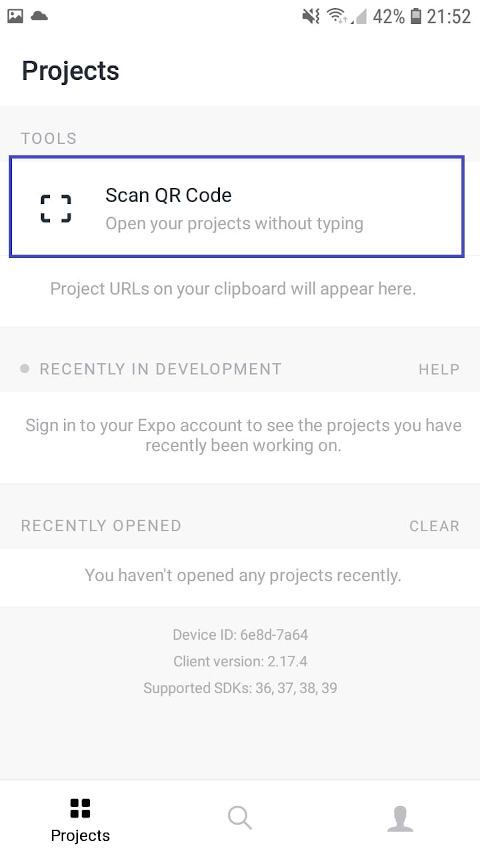

## General info


The idea behind the project was to make an application to search a movie.
In addition, I added a functionality that after searching movies, the user can, after clicking on the movie picture, get a description of the movie, and other information, such as movie rating.

User can search movies by name using input.
The API I used has its limitations that the minimum number of search characters should be greater than three.
For this reason, if the user enters fewer than three characters, a message is displayed to ask for more characters.
If it happens that the movie with the searched name is not found, an appropriate message will be displayed.
In the case of, for example, a missing photo or other API data, the information that the data was not found appears

## Running

There are two ways to open the application:

The first is a bit simpler using the "Play Store" on the android
<br>


<br>
<br>

<p style="font-size: 20px" > Then please install the "expo" application:</p>


<br>
<br>
<p style="font-size: 20px" > Then please open the expo application and scan the QR code below</p>
<br>


<br>


<br>
<br>


The second way to open the application:

Install dependencies first:
```shell script
npm install
```

Then run the application:

```shell script
npm start
```

Then type terminal "expo start" meanwhile you can open android simulator from android studio or iOS simlator.
After the expo init command, a website should open, where after clicking "Run on Android device / emulator" or "Run on iOS simulator" the application will appear on the simulator

<br>

## Additional information

The application contains basic configurations for adding the application, e.g. to the play store (only need a developer account)
<br>
## Technologies

Projects are created with:

- React Native
- API

